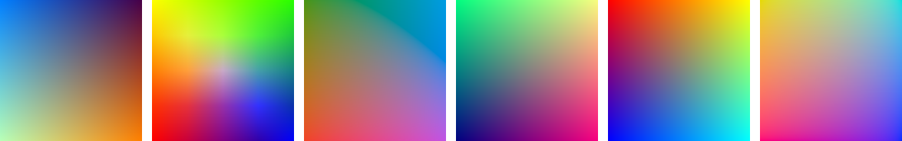

# Color2D - 2D Colormaps Javascript Plugin
This plugin allows you to encode two-dimensional information with color based on a 2D colormap. Examples include scatterplots of multivariate projections or the visual representation of Self-Organizing Maps.

A **demo** is available [here](http://dominikjaeckle.com/projects/color2d/).

**This plugin is based on the work of Steiger et al.**

> <b>Explorative Analysis of 2D Color Maps</b></br>
> Steiger, M., Bernard, J., Mittelstädt, S., Hutter, M., Keim, D., Thum, S., Kohlhammer, J.</br>
><i>Proceedings of WSCG (23), 151-160, Eurographics Assciation, Vaclav Skala - Union Agency, 2015</i>

## Usage
Integrate the color2D.js file:
```html
<script src="color2D.js"></script>
```

Set the Colormap and assign the colors in a callback function:
```javascript
Color2D.setColormap(Color2D.colormaps.BREMM, function() { 
    var rgb = Color2D.getColor(x, y);
});
```

The following colormaps are supported:
```javascript
Color2D.colormaps.BREMM; 
Color2D.colormaps.SCHUMANN; 
Color2D.colormaps.STEIGER; 
Color2D.colormaps.TEULING2; 
Color2D.colormaps.ZIEGLER;
```

You may also define your own 2D colormap. All you need is a .png file and set its dimensions.
```javascript
Color2D.colormaps.NEW_COLORMAP = "$path_to_png$.png";
Color2D.dimensions = {width: 512, height: 512};
```

Per default, Color2D expects your data to be feature scaled within the range [0,1]. However, you can also change the range according to your data:
```javascript
Color2D.ranges = {x: [0,1], y: [0,1]};
```
